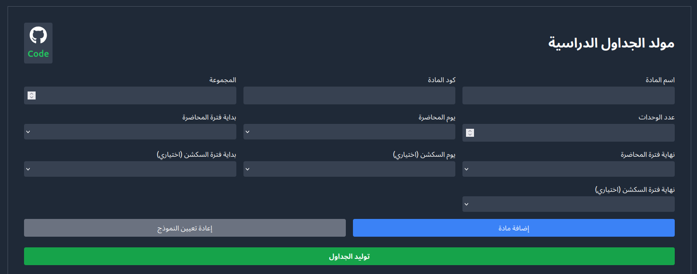
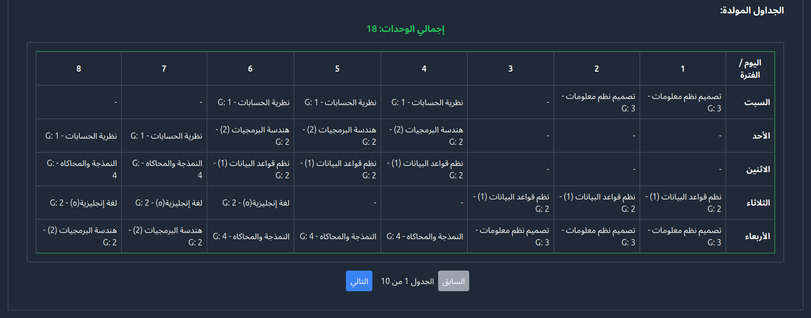

# 📅 Schedule Generator

Generate all possible schedules for your subjects with ease! 🚀






## ✨ Features

- 📚 Input multiple subjects and their available time slots
- 🧮 Generate all possible non-conflicting schedules
- 👀 View and compare different schedule options
- 📤 Export schedules for easy sharing or printing

## 🚀 Getting Started

1. Clone the repository:

   ```bash
   git clone https://github.com/anas-nady/schedule-generator.git
   cd schedule-generator
   ```

2. Install dependencies:

   ```bash
   npm install
   ```

3. Run the development server:

   ```bash
   npm run dev
   ```

4. Open [http://localhost:3000](http://localhost:3000) in your browser to use the application.

## 🎓 How to Use

1. Enter your subjects and their available time slots
2. Click "Generate Schedules"
3. Browse through the generated options
4. Select and export your preferred schedule

## 🧠 Algorithm: Dynamic Programming with Backtracking

The schedule generation algorithm uses a combination of dynamic programming and backtracking to efficiently create all possible non-conflicting schedules. Here's an overview of how it works:

1. **Initialization**: Create an empty schedule template for the week.

2. **Backtracking Function**:

   - For each subject, try to place it in its primary time slot.
   - If successful and there's a secondary time slot, try to place it as well.
   - Move to the next subject and repeat the process.
   - If all subjects are placed, add the schedule to the results.
   - If a placement fails, backtrack and try the next option.

3. **Conflict Checking**:

   - Before placing a subject, check for conflicts with already placed subjects.
   - Ensure no overlapping time slots or duplicate subject groups.

4. **Optimization**:

   - Use a Set to store unique schedules, avoiding duplicates.
   - Implement a limit on the number of generated schedules to prevent excessive computation.

5. **Result Generation**:
   - Convert the set of unique schedules back to an array of Schedule objects.

This approach allows for efficient generation of all possible schedules while avoiding conflicts and duplicates.

## 🛠️ Technologies Used

- Next.js
- React
- TypeScript
- Tailwind CSS
